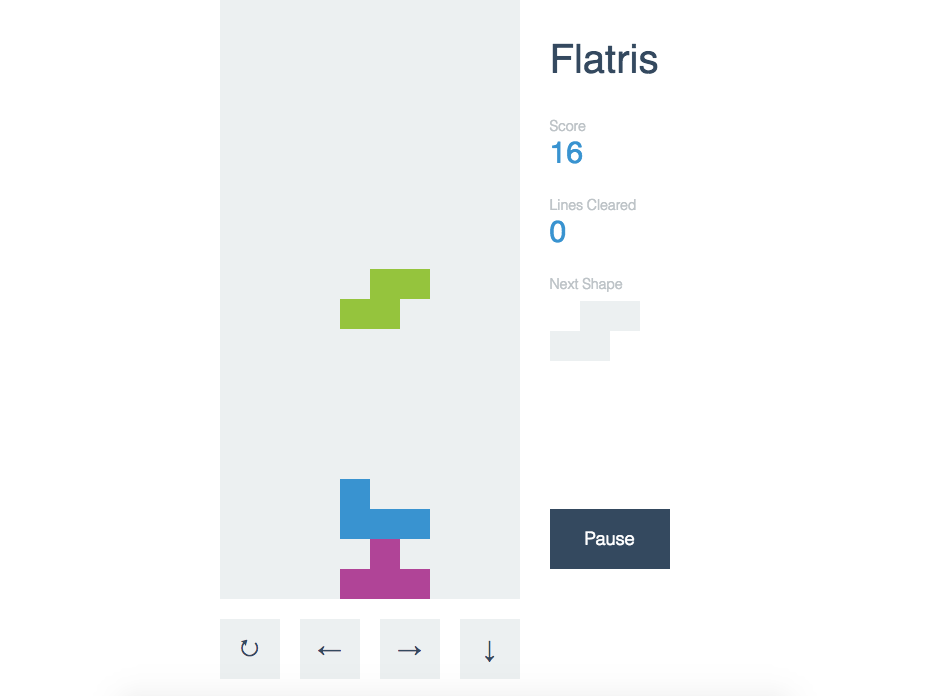
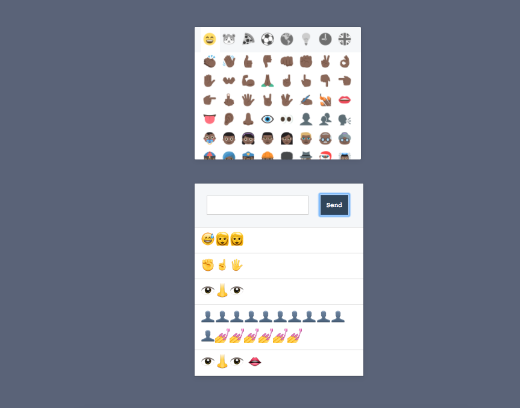

Here is an example of what elm can help users do.

#Intro
So what is elm? Elm is a functional language that compiles to javascript,html and css. It is suited for front end web development.

#Motivation: cuddly error messages
Why elm? Good question! If you're like me and you feel like most programming languages are passive aggressive or even down right cruel in their error handling then elm might just be the language for you! let me give you an example: As developers we are constantly exposing ourselves to new languages. The upside is that the more tools we have the more and better things we can build. The downside is that they all are kind of the same but kind of different in ways that can really hurt. Elm has far and away the gentelest error messages I have ever seen. An example: suppose you open the excellent [elm getting started guide](https://guide.elm-lang.org/) and try out this example in your REPL

```'Hello' ++ 'World'```

This is what you get back

Elm uses double quotes for strings. Switch the ' to " on both ends of the string
and you should be all set!

3|   'hello'++'world'
          ^
Maybe <http://elm-lang.org/docs/syntax> can help you figure it out.


So informative! So kind! The reason elm is able to be this nice is two fold. It is a compiled language so it parses the code before it is run, this allows for stricter error checking which leads to more precise error messaging. Secondly it is strictly typed. There are no 'truthy' values which removes a source of ambiguity from error messages.

#Data Types
Elm has the familiar data types like string, integer, and float as well as some that are less familiar. There is a list type that looks like an array but only holds values that have the same data type, a tuple is a list like structure that holds multiple data types and records are very similar to Javascript objects.

#You can get with this...or you can get with that!
One thing that may make or break elm for you is it's absolute rejection of object oriented principles. This on this from the docs
"Elm encourages a strict separation of data and logic, and the ability to say this is primarily used to break this separation. This is a systemic problem in Object Oriented languages that Elm is purposely avoiding."

A systemic problem! who knew?! Down with this!!!

#Design patterns:
As a functional language elm is big on separating concerns. The basic parts of an elm app are the model the view and the update. Very intuitive. You have your data you have a way to look at it and you have a way to update. The Model Update View paradigm is refered to as the 'Elm architecture'

#Installation
Elm makes it really simple to install their software and provides everything a 
user made need within the installation bundle. First, the user chooses a link 
that corresponds with OS they have. Then they click it and Elm is installed.
Once installed, Elm provides several different tools for users:

>elm-repl — play with Elm expressions
>elm-reactor — get a project going quickly
>elm-make — compile Elm code directly
>elm-package — download packages

Elm also has different plugins within the text editors like prettifiers and syntax highlighting. 


##Dependencies  
To install dependencies, users would have to enter: 
elm-package install /name of dependency/
For example if a user wanted to use NoRedInk/elm-decode-pipeline
They would write: elm-package install NoRedInk/elm-decode-pipeline

 To update dependecies, users would first have to run: 
 elm-package diff elm-lang/core 3.0.0 4.0.0
to see the differences between the version they have and the version they'd like to update to
just in case the updated version has things that might break their current apps. 3.0.0 is the code the user has
and 4.0.0 is the updated version.
Then, to update, the user would use change the version state in their package.json,
then run elm-package install elm-lang/core 4.0.0 which is the most current and updated version.

#React and Elm.
Elm is most similar to react in terms of what it is used for. They both create websites and web apps,
they both have a built in specific architecture. However, Elm can also be used within React, by using Elm's
React-Elm Component. After Elm has been compiled into Javascript within the app, the user would only
have to embed these lines of code:

import Elm from 'react-elm-components'
import { Todo } from '../dist/elm/todomvc.js'
 
function render() {
    return <Elm src={Todo} />
}

When these lines of code are pasted into a React App, the app now has the ability to use Elm in 
conjuction with React to carry over the simple functionality and error messaging help into React.

###Here is an example of a React-Elm component that is basically a chat app that updates in real-time. It adds emojis to the
textbox onclick and then adds them into the chatbox. There is no edit or delete function. 




